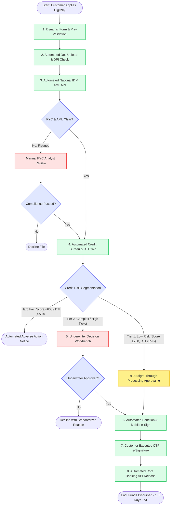

# TO-BE Process Model & Swimlane Specification

> **Disclaimer:** *Illustrative assumptions for portfolio case study — not real bank data.*

---

## 1. TO-BE Operating Model: Automation-First, Exception-Based

The optimized future-state (TO-BE) Personal Loan Origination process replaces the linear, paper-heavy workflow with an **Intelligent, Automation-First, Exception-Based Operating Model**.

```
+---------------------------------------------------------------------------------------------------+
|                                 TO-BE DUAL-TRACK ARCHITECTURE                                     |
+---------------------------------------------------------------------------------------------------+
|  1. Digital Intake & Pre-Validation ──► 2. Automated Registry KYC ──► 3. Automated Bureau DTI    |
|                                                                                                   |
|  ──► [DECISION ENGINE: Risk Segmentation & Policy Evaluation]                                      |
|       │                                                                                           |
|       ├─► TRACK A: Low-Risk / Tier 1 (Score ≥ 750, DTI ≤ 35%) ──► AUTOMATED STP APPROVAL (<10s)   |
|       │                                                                                           |
|       └─► TRACK B: Complex / High-Risk / Exceptions ──► INTELLIGENT UNDERWRITER QUEUE (Human)     |
|                                                                                                   |
|  ──► 4. Digital Sanction Letter & Mobile OTP e-Sign ──► 5. Instant Core Banking API Release (<15m)|
|  ──► 6. Real-Time Omni-Channel Status Tracking & Proactive SLA Monitoring (50% / 75% Alerts)     |
+---------------------------------------------------------------------------------------------------+
```

> **Important Risk Control Governance:** Human underwriting is **not removed**. Instead, automated Straight-Through Processing (STP) absorbs ~38% of standardized low-risk files, while 62% of complex, borderline, high-ticket, or self-employed cases route directly to specialized licensed underwriters with pre-analyzed workbench data.

---

## 2. 8-Swimlane TO-BE BPMN Activity Specification

### Swimlane 1: Retail Customer (Applicant)
1. **Task TO-01 (Automated Intake):** Completes dynamic digital application on mobile or web with real-time field validation.
2. **Task TO-02 (Assisted Upload):** Uploads required documents prompted by a personalized, profile-driven dynamic checklist.
3. **Event TO-03 (Instant Feedback):** Receives instant visual pre-validation check (green checkmark for clear DPI scans; instant re-take alert for blurry images).
4. **Task TO-04 (Self-Service):** Tracks application progression 24/7 across 5 visual milestone stages; receives automated SMS/Email updates.
5. **Task TO-05 (Digital Execution):** Reviews digital sanction letter and executes legally binding loan contract via mobile OTP e-Signature.

### Swimlane 2: Relationship Manager (Sales & Sourcing)
1. **Task TO-06 (Mobile Lead Capture):** Uses tablet-based advisor tool to run instant pre-eligibility estimators for walk-in or prospective clients.
2. **Task TO-07 (Advisor Role):** Focuses on high-value client advisory and closing complex applications rather than chasing missing paperwork.

### Swimlane 3: Branch / Loan Operations (Central Ingestion)
1. **Task TO-08 (Assisted Scanning):** For branch walk-ins, officers utilize high-speed barcode batch scanners that auto-index files directly to the core application record.
2. **Task TO-09 (Exception Handling):** Operations specialists only intervene on technical OCR extraction exceptions or severe document discrepancies.

### Swimlane 4: Automated Verification & Compliance Engine (System)
1. **Task TO-10 (Automated API):** Executes real-time REST API call to National Identity Registry to verify legal name, DOB, and address.
2. **Task TO-11 (Automated AML):** Performs automated real-time screening against global PEP and OFAC sanctions databases.
3. **Gateway TO-12 (Decision):** *Is KYC / AML clear?*
   - **FLAGGED:** Automatically routes file to Senior Compliance Officer queue with highlighted mismatch parameters.
   - **CLEAR:** Instantly transitions state to `KYC_VERIFIED` and triggers credit scoring.

### Swimlane 5: Automated Credit Decision Engine (System)
1. **Task TO-13 (Automated API):** Ingests full credit bureau file and credit score via secure bureau API connector.
2. **Task TO-14 (Algorithmic Calculation):** Aggregates existing debt obligations and computes Debt-to-Income (DTI) and FOIR ratios in real time.
3. **Gateway TO-15 (Decisioning Segmentation):** *Evaluate Tier 1 STP Eligibility (BR-RULE-06)*:
   - **TIER 1 (Low-Risk):** Score ≥ 750, DTI ≤ 35%, Loan ≤ $25,000, Salaried → **Automated Straight-Through Approval (STP)**.
   - **TIER 2 (Complex / Exception):** Score 650–749, DTI 36–50%, Self-Employed, Loan > $25,000 → Route to **Underwriter Worklist**.
   - **HARD DECLINE:** Score < 600, DTI > 50%, Bankruptcy → **Automated Decline with Adverse Action Notice**.

### Swimlane 6: Credit Underwriter (Exception Workbench)
1. **Task TO-16 (Unified Workbench):** Licensed underwriter opens single-screen workbench with pre-populated OCR figures, bureau highlights, and policy flags.
2. **Task TO-17 (Manual Decisioning):** Evaluates risk mitigants, approves with conditions, or issues counter-offer.
3. **Gateway TO-18 (Governance):** System requires standardized Adverse Action code or policy override justification before logging decision into immutable audit trail.

### Swimlane 7: Digital Agreement & Disbursement Gateway (System)
1. **Task TO-19 (Automated Issuance):** Generates personalized PDF loan sanction letter and embeds cryptographic e-Sign fields upon approval token receipt.
2. **Task TO-20 (Pre-Disbursement Gate):** Automatically validates e-Sign cryptographic token, bank account direct-debit mandate, and customer account name.
3. **Task TO-21 (Core Banking Trigger):** Executes automated payment release API instruction to Core Banking payment rails.

### Swimlane 8: Core Banking & SLA Monitoring Engine
1. **System TO-22 (Instant Posting):** Core Banking payment engine credits loan funds directly to customer account within **15 minutes**.
2. **System TO-23 (Real-Time SLA Monitor):** Background daemon tracks task elapsed times across all active queues; dispatches amber alerts at 50% SLA threshold and red escalation emails at 75% threshold.

---

## 3. TO-BE Process Flow Chart (Mermaid Specification)


